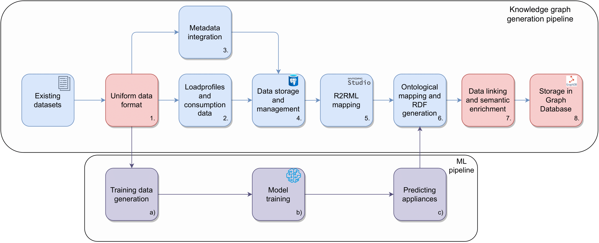

# Electricity Knowledge Graph
This repository contains the source code and the dataset for the paper [Towards Data-Driven Electricity Management: Multi-Region Harmonized Data and Knowledge Graph](https://arxiv.org/abs/2405.18869)

The repository includes downloads for the datasets and all the neccesary code to run the pipeline for preprocessing the data and generating the knowledge graph. The knowledge graph is generated from a set of raw datasets containing electricity consumption data from multiple regions and households. The data is preprocessed and harmonized to generate a knowledge graph containing information about the households, appliances, and electricity consumption.
We also provide a model training pipeline that can be used to train a model for on/off appliance classification.


<!-- add pipeline from images/pipeline.pdf -->



# File structure

- `data` - contains the raw datasets and their metadata and later preprocessed data
- `scripts` - contains the scripts for preprocessing the data and populating the database
- `notebooks` - contains notebooks for data exploration and model training(TODO may remove)
- `src` - contains model training and evaluation code and some helper scripts
- `requirements.txt` - contains the python dependencies for the project without tensorflow
- `requirements.tensorflow.txt` - contains the python dependencies for tensorflow


## Installation / Use

The scripts are described in more detail in the [scripts README](src/README.md).

To use the pipeline, you need to download either the full harmonized data dump from our Figshare repository or the sample dataset. Additionally, the metadata needs to be downloaded and extracted into the data folder. The `./data/` folder should contain two subdirectories: one for the metadata and another for the harmonized datasets.

Before proceeding, ensure that the paths in the [pipeline_config.py](configs/pipeline_config.py) (PARSED_DATA_PATH and METADATA_PATH) file point to the correct folders for the harmonized data and metadata. Once everything is set up, you can start from step 4 below


1. Start a terminal and clone this [repository](https://github.com/sensorlab/energy-knowledge-graph) `git clone https://github.com/sensorlab/energy-knowledge-graph`

3. Unzip the `data_dump_full.tar.gz` file in the data directory using `tar -xvf data_dump_full.tar.gz -C data`, optionally you can use only the data_sample.tar.gz file `tar -xvf data_sample.tar.gz -C data` instead 
4. Make sure that `./data/`folder contains contains required datasets and metadata data folder should be of structure `./data/metadata/` containing metadata and `./data/raw/` containing raw datasets
2. Navigate into energy-knowledge-graph directory, enter conda or virtualenv, and install dependecies with `pip install -r requirements.txt` for data preprocessing 
and `pip install -r requirements.tensorflow.txt --extra-index-url https://pypi.nvidia.com` if you want to use the machine learning part of the pipeline
5. Create an .env file in the [scripts](./scripts/) directory with the following content:
    ```bash
    DATABASE_USER=<username to access PostgreSQL database>
    DATABASE_PASSWORD=<password to access PostgreSQL database>
    ```
6. Check [pipeline_config.py](configs/pipeline_config.py) for the configuration of the pipeline leave as is for default configuration
7. Run `python scripts/process_data.py` by default this will preprocess the datasets defined in [pipeline_config.py](configs/pipeline_config.py) and store it in the database if we pass the command line argument `--sample` it will preprocess only the datasets present in the sample dump and if we pass `--full` it will preprocess all the datasets present in the full dump


# Dataset download

The full raw dump contains all the datasets and their coresponding metadata, while the sample raw dump contains a subset of the full raw dump. The triples dump contains the triples forming the knowledge graph in turtle format, while the harmonized data dump contains the harmonized data in pickle files the harmonized data is the same as the output of the pipeline in step 1.

* Full raw dump(91.2 GB): [data_dump_full.tar.gz](http://sensorlab.ijs.si/archive/energy-knowledge-graph/data_dump_full.tar.gz)
* Sample raw dump(10.4 GB): [data_sample.tar.gz](http://sensorlab.ijs.si/archive/energy-knowledge-graph/data_sample.tar.gz)
* All raw datasets can be downloaded separately from the [data folder](http://sensorlab.ijs.si/archive/energy-knowledge-graph/partial-files-raw/)


The following files are also available for download on figshare: (TODO link when available):
* Metadata dump(1.2 GB): [metadata.tar.gz](https://sensorlab.ijs.si/archive/energy-knowledge-graph/partial-files-raw/metadata.tar.gz)
* Triples dump (125 MB): [triples.ttl](http://sensorlab.ijs.si/archive/energy-knowledge-graph/triples.ttl)
* Harmonized data dump(80 GB): [harmonized.tar.gz](http://sensorlab.ijs.si/archive/energy-knowledge-graph/harmonized.tar.gz)

The datasets used in this project are unified from the following open research datasets:

1. [DEDDIAG](https://www.nature.com/articles/s41597-021-00963-2)
2. [DEKN](https://data.open-power-system-data.org/household_data/)
3. [DRED](https://www.st.ewi.tudelft.nl/~akshay/dred/)
4. [ECDUY](https://www.nature.com/articles/s41597-022-01122-x)
5. [ECO](https://www.st.ewi.tudelft.nl/~akshay/dred/)
6. [EEUD](https://www.sciencedirect.com/science/article/pii/S1359431116312649?via%3Dihub#ab005)
7. [ENERTALK](https://www.nature.com/articles/s41597-019-0212-5)
8. [HEART](https://zenodo.org/records/7997198)
9. [HES](whttps://github.com/ETSSmartRes/HES-Dataset)
10. [HUE](https://dataverse.harvard.edu/dataset.xhtml?persistentId=doi:10.7910/DVN/N3HGRN)
11. [IDEAL](https://www.nature.com/articles/s41597-021-00921-y)
12. [IAWE](https://iawe.github.io/)
12. [LERTA](https://zenodo.org/records/5608475)
13. [PRECON](https://web.lums.edu.pk/~eig/precon.html)
14. [REDD](https://tokhub.github.io/dbecd/links/redd.html)
14. [REFIT](https://pureportal.strath.ac.uk/en/datasets/refit-electrical-load-measurements-cleaned)
15. [SUST1](https://osf.io/2ac8q/)
16. [SUST2](https://osf.io/jcn2q/)
17. [UCIML](https://doi.org/10.24432/C58K54)
18. [UKDALE](https://jack-kelly.com/data/)


 This project is meant for scientific and research purposes and so are the datasets.


## Detailed pipeline script usage

The pipeline can be customized by changing the configuration in the [pipeline_config](configs/pipeline_config.py) file.

In the [pipeline_config.py](configs/pipeline_config.py) file you can set the following parameters:


- `STEPS` - list of data processsing steps to be executed
- `DATASETS` - list of datasets to be preprocessed
- `TRAINING_DATASETS` - list of datasets to be used to generate the training data
- `PREDICT_DATASETS` - list of unlabelled datasets to run the pretrained model on
- `POSTGRES_URL` - the url for the postgres database to store the data
- various paths for where to store the data and where to read the data from this is explained in more detail in the [pipeline_config](configs/pipeline_config.py) file


The pipeline contains the following data processing steps:

1. [parse](src/run_parsers.py) - This script runs the parsers for the datasets and stores the parsed datasets in pickle files
2. [loadprofiles](src/loadprofiles.py) - This script calcualtes the load profiles for the households
3. [metadata](src/generate_metadata.py) - This script generates metadata for the households and stores it in a dataframe as a parquet file
4. [consumption-data](./scripts/consumption_data.py) - This script calculates the electrictiy consumption data for the households and their appliances
5. [db-reset](./scripts/db_reset.py) - This script resets and populates the database with the households metadata, load profiles and consumption data


and the following steps for predicting devices using a pretrained model (requires tensorflow):

1. [predict-devices](src/label_datasets.py) - This script predicts the devices for the households using a pretrained model
2. [add_predicted_devices](src/add_predicted_devices.py) - This script adds the predicted devices to the knowledge graph


## Training pipeline usage

The training pipeline consists of the following steps:

1. [generate_training_data.py](scripts/generate_training_data.py) - This script generates the training data for on/off appliance classification from the training datasets specified in the [model_config.py](configs/pipeline_config.py) file the training datasets have to be parsed by running the parse step in the pipeline beforehand.
2. [train.py](scripts/train.py) - This script trains the model on the training data generated in the previous step and saves the model in the specified path in the [model_config.py](configs/pipeline_config.py) file various hyperparameters and training settings can also be set in the config file.
3. [eval.py](scripts/eval.py) - This script evaluates the model on the test data and saves the evaluation metrics in the specified path in the [model_config.py](configs/pipeline_config.py) file.

Quick start guide for training pipeline:
```bash
      # navigate to the scripts directory
      cd energy-knowledge-graph/scripts
      # open the model_config.py file and set the paths and to the data and select the datasets to be used for training
      # generate training data
      python generate_training_data.py

      # open the model_config.py file and set the hyperparameters and training settings
      # train the model
      python train.py

      # evaluate the model
      python eval.py
    
```


# SPARQL examples

We provide some example SPARQL queries that can be run on the knowledge graph. We also host a [SPARQL endpoint](https://sparqlelec.ijs.si/) where you can test your queries.


## Example 1: Query all countries with GDP greater than 50000

```sparql
PREFIX voc: <https://elkg.ijs.si/ontology/>
PREFIX saref: <https://saref.etsi.org/core/>
PREFIX rdf: <http://www.w3.org/1999/02/22-rdf-syntax-ns#>
PREFIX schema: <https://schema.org/>
SELECT ?gdp ?location ?countryName WHERE {
  ?location rdf:type schema:Place . 
  ?location voc:hasGDPOf ?gdp .
  ?location schema:containedInPlace ?country .
  ?country rdf:type schema:Country .
  ?country schema:name ?countryName .
  FILTER(?gdp > 50000) .
} 

```


## Example 2: Query all devices in a house with name "LERTA_4"

```sparql
PREFIX voc: <https://elkg.ijs.si/ontology/>
PREFIX saref: <https://saref.etsi.org/core/>
PREFIX rdf: <http://www.w3.org/1999/02/22-rdf-syntax-ns#>
PREFIX schema: <https://schema.org/>
SELECT DISTINCT ?house ?devices ?deviceNames ?houseName WHERE {
 ?house rdf:type schema:House .
 ?house schema:name ?houseName .
 ?house voc:containsDevice ?devices .
 ?devices schema:name ?deviceNames .
 FILTER(?houseName = "LERTA_4").

} 

```

## Example 3: Query household "UKDALE_1" and the city it is in as well as the corresponding city in dbpedia and wikidata

```sparql
PREFIX voc: <https://elkg.ijs.si/ontology/>
PREFIX saref: <https://saref.etsi.org/core/>
PREFIX rdf: <http://www.w3.org/1999/02/22-rdf-syntax-ns#>
PREFIX schema: <https://schema.org/>
PREFIX wdt: <http://www.wikidata.org/prop/direct/>
PREFIX wd: <http://www.wikidata.org/entity/>
PREFIX owl: <http://www.w3.org/2002/07/owl#>
PREFIX dbo: <http://dbpedia.org/ontology/>

SELECT DISTINCT ?houseName ?city ?dbpediaCity ?wikidataCity WHERE {
  ?house rdf:type schema:House .
  ?house schema:name ?houseName .
  ?house schema:containedInPlace ?place .
  ?place schema:containedInPlace ?city .
  ?city rdf:type schema:City .
  
  OPTIONAL {
    ?city owl:sameAs ?linkedCity .
    FILTER(STRSTARTS(STR(?linkedCity), "http://dbpedia.org/resource/"))
    BIND(?linkedCity AS ?dbpediaCity)
  }
  
  OPTIONAL {
    ?city owl:sameAs ?linkedCity2 .
    FILTER(STRSTARTS(STR(?linkedCity2), "http://www.wikidata.org/entity/"))
    BIND(?linkedCity2 AS ?wikidataCity)
  }
  
  FILTER(?houseName = "UKDALE_1")
}
    
```

If you use this dataset or pipeline in your research, citation of the following paper, which also provides additional details about the dataset and the processing pipeline, would be greatly appreciated:
```
    @article{hanzel2024datadriven,
          title={Towards Data-Driven Electricity Management: Multi-Region Harmonized Data and Knowledge Graph}, 
          author={Vid Hanžel and Blaž Bertalanič and Carolina Fortuna},
          year={2024},
          eprint={2405.18869},
          archivePrefix={arXiv},
          primaryClass={cs.LG}
    }
```
